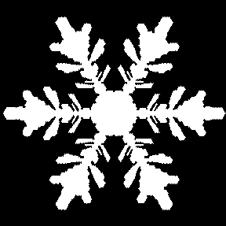
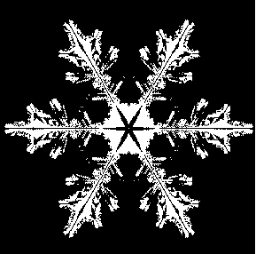
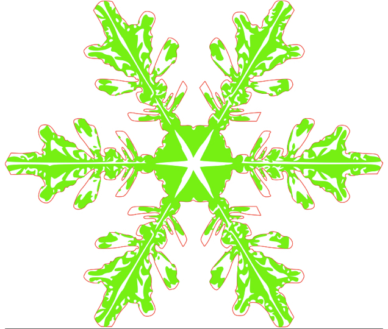
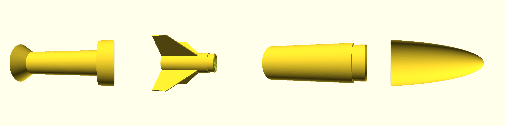
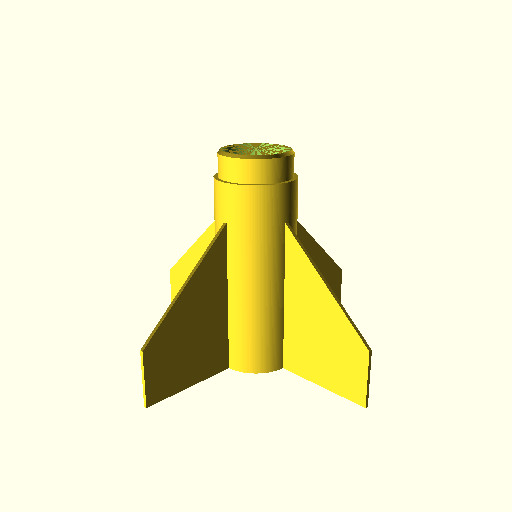
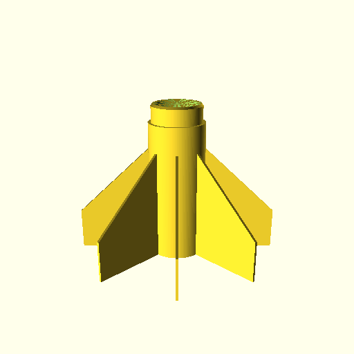
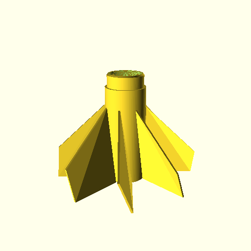

## Laser Cutters
## 3D Printers 
## and Python
&nbsp; <p />
May, 2016 - Giles Hall

# END #

# Giles Hall
## github.com/vishnubob
## <i>giles@polymerase.org</i>

Note:
My name is Giles Hall.  I've been using python since 1996, and at this point, I consider it my mother tongue.  I utilize python throughout my life.  

# END #
<section data-background-image="images/ginkgo.png" />

Note:
Currently, I work for a company in Boston called "Ginkgo Bioworks" -- We apply genetic engineering to build useful customized organisms.  I use python to preform data analysis to help our engineering efforts.  We are hiring!  

# END #
<section data-background-image="images/hobbies.png" />

Note:
I have many hobbies, including photography, gardening, cycling, cooking, electronics and making art.  And for each one of my hobbies, I've written at least a handful of python scripts related to it.

# END #
<section data-background-image="images/garden.png" />

Note:
Here is a quick example.  In my backyard, I have a Davis weather station.  This transmit weather data wirelessly to a Raspberry Pi in my house.  I have another Raspberry Pi in the basement that monitors these data, and controls a set of relays that switch on spinklers for the garden.  To me, python is not just a programming language.  It's a tool I use to creatively express myself. 

# END #
<section data-background-image="images/not-art.jpg" />

Note: 
But, as powerful as python is, programming by its very nature is not a physical medium.  [beat] Frederic P. Brooks wrote one of my favorite quotes about computer programming in his book The Mythical Man-Month 

# END #
<blockquote>
&ldquo;The programmer, like the poet, works only slightly removed from pure thought-stuff. She builds her castles in the air, from air, creating by exertion of the imagination.&rdquo;
</blockquote>
&#45; Frederic P. Brooks, <i>The Mythical Man-Month</i>

Note:
"The programmer, like the poet, works only slightly removed from pure thought-stuff. She builds her castles in the air, from air, creating by exertion of the imagination."  [beat] The world is filled with these amazing but nebulous castles, but we can only really appreciate them with the aid of a computer.  You can't share your code like you would a painting or a sculpture or a well cooked meal.

# END #
# How do we make code physical and tangible?

Note:
I realize not everything I said is true, we use software to manipulate our physical world every day.
# END #

<section data-background-image="images/physical.png" />

Note:
Our computers produce sound, and light and churn out printed documents.  There are many ways you can write code as a generator for these processes.  This is what I want to talk about, how to use code to design physical objects with python.

# END #
<section data-background-image="images/machine_age.png" />

Note:
Before there were computers, people had to make things by hand.  The period between the late 19th century and the middle of the 20th century was collectively known as the "Machine Age".  During this time, we perfected the art of building parts at an industrial scale using a process called "subtractive manufacturing".  This includes processes such as milling, turning, boring, broaching, sawing, reaming and tapping.  The general idea was to shape bulk stock into some kind of part by removing material with incredible precision.

# END #

<section data-background-image="images/atomic_age.png" />

Note:
After the 1950s, the world entered the atomic age and ushered in the digital computer.  During the 1940s and 50s, existing tools like mills and lathes were connected to electric motors that were controlled with punched tape.  This was the first step towards automation of machine tools, and as computers evolved in sophistication, it spawned a new field of fabrication called Computer Numerical Control, known as CNC.

# END #

<section data-background-image="images/cnc.png" />

Note:
Today, computer controlled automation is ubiquitous throughout all areas of manufacturing.  Not only has the computer hardware and software programming evolved in sophistication, but there are new manfacturing tools and processes that have only existed in the last few decades.  This includes plasma cutters, water jets, 5-axis milling machines, lithography... and two of my favorite technologies.

# END #

<image height="400px" src="images/zing.jpg" /> <image height="400px" src="images/thingomatic.jpg" />

Note:
laser cutters and 3D printers.  From here, we will examine each of these technologies and discuss how we can use Python to create designs for these tools.  First, laser cutters!

# END #

<section data-background-image="images/laser.png" />

Note:
Laser-cutters are devices that utilize high-powered lasers to etch or cut a variety of different materials. 
Most commercially available laser cutters are capable of cutting and etching paper, wood, plastic, leather, and fabric up to a certain thickness.  
The laser tube is static to the device, typically mounted towards the back. 
Carefully positioned mirrors bouce the laser light to the laser head.  
The head is composed of mirrors and lenses that focus the laser beam onto the target material.  
Stepper motors traverse the head in the X/Y plane parallel to the work material, tracing out the contours for a given design.  
Laser cutters are incredibly precise, and are capable of producing complex designs with intricate detail.

# END #
<section data-background-image="images/raster_vs_vector.png" />

Note:
Digital designs for laser cutting typically start as vector graphics.  Design programs like Adobe Illustrator and Inkscape are vector illustration packages.  This is in contrast to programs like the GIMP and Photoshop, which are raster, or bitmap, oriented graphic packages.  Vector graphics make it easy for the software controlling the motion of the laser cutter to translate the graphics into motion.  

# END #

<svg xmlns="http://www.w3.org/2000/svg" version="1.1"
      width="700" height="250" viewBox="0 0 700 250">
  <rect x="350" y="23" width="200" height="200" fill="darkred"
      stroke="white" stroke-width="10" />
  <circle cx="300" cy="100" r="80" fill="cyan"
      stroke="darkgrey" stroke-width="5" />
</svg>

```xml
<svg xmlns="http://www.w3.org/2000/svg" version="1.1"
      width="120" height="120" viewBox="0 0 236 120">
  <rect x="14" y="23" width="200" height="7" fill="red"
      stroke="black" stroke-width="1" />
  <circle cx="24" cy="33" r="25" fill="green"
      stroke="blue" stroke-width="2" />
</svg>
```

Note:
This is a simple example of an SVG document.  SVG files are XML documents, and a closely related cousin to HTML.  HTML and SVG share a lot of the attribute names for various tags, like width, height, style, and border.  They share style syntax as well, and later revisions of SVG support cascading style sheets. 

# END #

<svg xmlns="http://www.w3.org/2000/svg" version="1.1"
      width="400" height="240" viewBox="0 0 400 240">
  <rect x="10" y="10" width="100" height="100" fill="red"
      stroke="white" stroke-width="10" />
  <rect x="60" y="60" width="100" height="100" fill="green"
      stroke="white" stroke-width="10" />
  <rect x="110" y="110" width="100" height="100" fill="blue"
      stroke="white" stroke-width="10" />
</svg>

```xml
<svg xmlns="http://www.w3.org/2000/svg" version="1.1"
      width="400" height="240" viewBox="0 0 400 240">
  <rect x="10" y="10" width="100" height="100" fill="red"
      stroke="white" stroke-width="10" />
  <rect x="60" y="60" width="100" height="100" fill="green"
      stroke="white" stroke-width="10" />
  <rect x="110" y="110" width="100" height="100" fill="blue"
      stroke="white" stroke-width="10" />
</svg>
```

Note:
One tricky gotcha about SVG is that the coordinate system starts at (0, 0) in the top left corner, and increases in value as you travel towards the right of the screen in the X-axis as well as down towards the bottom of the screen in the Y-axis.  For example, notice that the red square has the smallest XY insertion point at (10, 10) while the blue square has the largest insertion point of (110, 110).


# END #
<svg xmlns="http://www.w3.org/2000/svg" version="1.1"
      width="400" height="240" viewBox="0 0 400 240">
    <path d="M 20,20 L 40,40 L 40,80 L 80, 80 L 100, 120, L 20, 220 L 200, 200"
        fill="none" stroke="white" stroke-width="10" />
</svg>

```xml
<svg xmlns="http://www.w3.org/2000/svg" version="1.1"
      width="400" height="240" viewBox="0 0 400 240">
    <path d="M 20,20 L 40,40 L 40,80 L 80, 80 L 100, 120, L 20, 220 L 200, 200"
        fill="none" stroke="white" stroke-width="10" />
</svg>
```

Note:
Now for the best part of SVG, paths.  A path is simply a list of connected like segments that are used to build complex ploygons.  Segments can be straight or curved with control points.  Coordinates can be specified in absolute coordinates or relative coordinates.  The path itself is broken up into single letter commands like 'M' for "move" or "L" for line and then two or more numbers that represent coordinates.  You can do a lot with just circles and squares, but paths allow us to build incredibly complex shapes.  When we start thinking about the laser cutter, our path might dictacte the exact path the laser head will follow.

# END #
<section data-background-image="images/dovetail_case.png" />

# END #
<section data-background-image="images/example_box.svg" />

# END #
<section data-background-image="images/example_box_polarity.svg" />

# END #
<section data-background-image="images/box_teeth.svg" />

# END #
<section data-background-image="images/teeth_schematic.svg" />

# END #
```python
import svgwrite

def wave(size, finger_count, finger_width, thickness):
    center = map(lambda pos: pos / 2.0, size)
    pen_x = center[0] - ((finger_count + 1) / 2.0 * finger_width)
    pen_y = center[1]
    y_map = [thickness, 0, -thickness, 0]
    x_map = [0, finger_width]
    for idx in range(finger_count * 2 + 2):
        pen_x += x_map[idx % 2]
        pen_y += y_map[idx % 4]
        yield (pen_x, pen_y)
```

# END #
```python
size = (800, 200)
wavepts = list(wave(size, finger_count=12, finger_width=50, thickness=20))
path = ("M %s,%s" % path[0]) + 
        str.join(' ', ["L %s,%s" % pt for pt in path[1:]])
dwg = svgwrite.Drawing("images/wave.svg", size=size)
dwg.add(dwg.path(d=path, fill="none", stroke="red", stroke_width=10))
dwg.save()
```

# END #
<section data-background-image="images/wave.svg" />

# END #
``` python
import math
import svgwrite

def sunflower(canvas, size, florets=200, floret_radius=5):
    center = map(lambda pos: pos / 2.0, size)
    constant = (min(center) - floret_radius * 2.0) / math.sqrt(florets)
    for idx in range(1, 1 + florets):
        radius = constant * math.sqrt(idx)
        angle = idx * math.radians(137.5)
        pt = (radius * math.cos(angle), radius * math.sin(angle))
        pt = map(sum, zip(center, pt))
        canvas.add(dwg.circle(pt, fill="lightgrey", r=floret_radius))

size = (700, 700)
dwg = svgwrite.Drawing("images/sunflower.svg", size=size)
sunflower(dwg, size, floret_radius=10)
dwg.save()
```
<a href="http://localhost:8888/notebooks/PyCon2016%20Notebook.ipynb" data-preview-link>demo</a>

# END #

<image height="700" src="images/thingomatic.jpg" />

Note:
3D printers are devices that can build 3D objects.  They range in price and sophistication, but the most common 3D printers available are known as a "Fused deposition modeling" systems.  3D printers work by breaking down 3D objects into 2D slices, that when stacked one on top of the other, will reconstruct the geomtery of the 3D object.  FDM printers work by extruding plastics at high temperatures.  Unlike laser cutters, 3D printers work in three axises.  The X and Y axis are utilized by the print head to deposit the material in the desired shape, and the Z-axis is used to advanace the model to the next 2D slice.

# END #

# IMAGES OF DESIGN SOFTWARE

Note:
About five years ago, my girlfriend and I purchased our first 3D printer.  It's an original Ultimaker, although I've heavily modified it over the years.  I was so excited when I got it, thinking of all the things I would design and print on it, but I was immediately frustrated with the standard tools people typically use to design CAD models for printing.  I would spend hours in programs like sketchup, building up a complex design only to realize I needed to change something core to the model.  Most of the design tools do not make it easy to make these kind of drastic changes.  It's like painting a family portrait only to realize you left our your brother.

There are more sophisticated 3D modelers out there, including some that allow for parametric designs, but most are expensive, or only run on Windows, or are difficult to learn.  I looked around to try to find a programmatic solution, and that's how I discovered OpenSCAD.

# END #

<image height="700px" src="images/openscad.png" />

Note:
OpenSCAD is utilizes "Constructive Solid Geometry".  The idea is to build your objects from 2D and 3D primitives, such as cubes, cylinders and spheres.  You position these solid objects in space, and then define boolean operations between them.  The two most common boolean operations are Union, to join two or more solids as one and Difference, to subtract one or more solids from another.

# END #

<image height="700px" src="images/drinking_glass.jpg" />

# END #

```python
difference()
{
    cylinder(r=20, h=80);
    translate([0, 0, 1])
    {
        cylinder(r=18, h=80);
    }
}
```

Note:
For example, consider a drinking glass.  It can be constructed with two cylinders.  The first describes the outside surface, and the second describes the empty volume inside.  Using OpenSCAD, we would define the first cylinder with a second cylinder inside.  The inside cylinder would be offset in the Z-axis (the up axis), and would have a smaller radius then the first.  We would then subtract the inner cylinder from the outer cylinder to create its empty envelope.  In order for this to work, we need to offset the inner cylinder's from the outer cylinder.

# END #

<image height="700px" src="images/flowerpot.jpg" />

Note:

Let's examine something a little more complicated, a flower pot.  Flower pots are similar to drinking glasses, but they also have a few distinct features.  First, most flower pots are wider at the top and smaller at the bottom.  Second, they usually have some kind of hole at the bottom to allow the water to drain.  And finally, they often have a lip at the top to make them easy to hold on to and move around.

# END #

```python
class FlowerPot(SCAD_Object):
    radius_ratio = 0.7
    top_radius = inch2mm(2.5)
    bottom_radius = top_radius * radius_ratio
    height = inch2mm(2.5)
    thickness = inch2mm(.125)
    drain_hole = bottom_radius * .1
    standoff = 2
    bottom_thickness = thickness + standoff
    collar_radius = top_radius + inch2mm(.125)
    collar_height = height * .2
```

Note:
Before we design our flowerpot, now that we have a feeling for OpenSCAD's syntax, let's talk about how we can generate these files from python.  There are a few different python libraries out there that allow you to build OpenSCAD syntax from python, including one library I've written called `python-scad`.  Most of these libraries work in similar ways, wrapping OpenSCAD definitions with python classes.  For my demo, I will be using my library, but you can accomplish nearly the same thing with some of the other available options out there.


# END #

```python
    def scad(self):
        outer_pot = Cylinder(r1=self.bottom_radius, r2=self.top_radius, h=self.height)
        collar = Cylinder(r=self.collar_radius, h=self.collar_height)
        collar = Translate(z=self.height - self.collar_height)(collar)
        outer_pot = Union()(collar, outer_pot)
        inner_pot = Cylinder(r1=self.bottom_radius - self.thickness, 
            r2=self.top_radius - self.thickness, h=self.height - self.bottom_thickness)
        inner_pot = Translate(z=self.bottom_thickness)(inner_pot)
        standoff = Cylinder(r=self.bottom_radius - self.thickness, h=self.standoff)
        inner_pot = Union()(inner_pot, standoff)
        pot = Difference()(outer_pot, inner_pot)
        drain_hole = Cylinder(r=self.drain_hole, h=self.bottom_thickness)
        pot = Difference()(pot, drain_hole)
        pot = Render()(pot)
        return pot
```

# END #

# Snowflake Generator

# END #

<section data-background-image="images/snowflake_actual.jpg" />

Note:
Now I would like to wet your appetite by talking about two of my projects, one for laser cutting and the other for 3D printing.  The first is a project my girlfriend and I started about four years ago.  We were trying to figure out what to make our friends and family for the holidays.

# END #

<section data-background-image="images/snowflake_paper.jpg" />

Note:
Rachael found this amazing paper that describes a physical model to simulate the growth of snowflakes.  We translated the math from the paper into python code, and proceeded to make personalized snowflakes for everyone on our gift list.

# END #

<section data-background-image="images/snowflake_hexgrid_empty.jpg" />

Note:
The model works at the "mesoscopic" level, which is to say a collection of molecules of an undefined unit.  It starts by creating an hexagonal grid.

# END #
<section data-background-image="images/snowflake_hexgrid_seeded.jpg" />

Note:
This grid is then populated grid with an homogenuous field of water molecules.  These water molecules can then move from one neighboring cell to another, and can switch between three defined states "vapour", "boundary", and "frozen".  The initial field of water molecules are set to a vapour state, except for the cell in the middle, which is initialized as a frozen state.  From there, the simulation runs and a snowflake begins to form.

# END #

<section data-background-image="images/snowflake_hexgrid_step1.jpg" />

Note:
As the simulation progresses, the snowflake crystal begins to grow from the initial central seed.  

# END #

<section data-background-image="images/snowflake_hexgrid_step2.jpg" />

# END #

<section data-background-image="images/snowflake_hexgrid_step2.jpg" />

# END #

<section data-background-image="images/snowflake_bitmap.jpg" />

Note:
This builds a complex bitmap, but instead of capturing RGB intensities on a cartesian grid, the bitmap stores the density of frozen water molecules with a hexagonal grid.  When the snowflake reaches a certain pre-detemined size, the simulation stops and the program proceeds to translate the snowflake into SVG files.

# END #

 
<p />


Note:
Two SVG files are produced and merged.  The first SVG file is a representation of densest parts of the snowflake.  That is, where the water molecules were in the highest abudance when they froze.  The second SVG file defines the outline of the snowflake.  These two files are then merged into a single SVG file, and sent to the laser cutter.

# END #

<section data-background-video="video/snowflakes.mp4" data-background-video-loop data-background-video-muted>
</section>

Note:
The mathematical model is both complex and sophisticated.  It has 8 different parameters that help define the overall structure of the final snowflake.  We took this one step further, and allowed the parameters to change over the snowflakes growth, the anology being as a snowflake grows in weight, it begins to fall and thus its environment changes.  To personalize these snowflakes, we used the name of the intended receipient as the seed to these parameters.  What makes this algorithm so incredible is the range of snowflake species we were able to produce from it.

# END #

# ROCKIT

# END #

<section data-background-image="images/rockit_launch.png" />

Note:
The second project I want to talk to you about is something I called Rockit, spelled ROCKIT.  Rockit is a model rocket generator, written in python, and capaable of producing a wide variety of model rocket designs.  This was one of the first projects I worked on that coupled Python with OpenSCAD.  

# END #

<section data-background-image="images/model_rocket_motors.jpg" />

Note:
If you are not familar with model rocketry, you should know there are a range of engine sizes.  These engines are made of solid propellant packed into a cardboard tube.  The sizes vary in length and diameter, requiring different sized engine holders.  In order to build a model rocket, you first need to define the engine size.  This parameter is used to calculate other sizes, like the diameter of the rocket body and the overall size.

# END #



Note:
A second design feature of these rockets are the coupling sleeves used to hold the rocket together.  They work a litle like legoes, making it easy to print a rocket and snap it together without the need for glue (although a little super glue goes a long way in ensuring your rocket stays together during its flight).

# END #

<section data-background-image="images/rockit_two_stage.png" />

Note:
You can even print the base of the rocket with sleeves, which allows you to build multi-stage rockets.

# END #

  

Note:
And the best feature of rockit is that you can easily change different aspects of your design.  For example, you can swap in different kinds of nose cones, or you can add/remove fins.  One of my favorite design tweaks is to give the fins a slight tilt which makes the rocket rifle up as soon as it is launched.  Since your designs are reproducible, you can easily tweak an existing design and measure its performance characteristics compared to a previous design.

# END #

<section data-background-video="video/rocket_launch.mp4" data-background-video-loop data-background-video-muted>
</section>

Note:
I would say the only down side is that these rockets are easily damaged.  The hot gases from the motor can sometimes warp and distort the plastic and hard landings typically result in catestrophic failure.  But, I say who cares, you can just go home and print more rockets.

# END #

# Ponoko / Shapeways
# Local library
# Local maker spaces

Note:
I realize not everyone has access to these tools, but don't despair, they might be able available to you within a few miles of your house.  In Boston, there are a number of local maker spaces that provide access to 3D printers and laser cutters such as the Artisan's Asylum and Danger!Awesome.  Also, some local public libraries have booted up their own maker areas that provide access to these tools.  If you can't find anything local, you can always use some of the popular internet based service providers, such as Ponoko or Shapeways.  For example, all the laser cut designs I brought for this talk were cut at Ponoko.  This area is rapidly expanding, and new tools are coming out every year.  And every year, it seems like the cost of ownership for these tools comes down in price.

# END #

[https://github.com/vishnubob/pycon2016](https://github.com/vishnubob/pycon2016)
[https://github.com/vishnubob/pyscad](https://github.com/vishnubob/pyscad)
[https://github.com/vishnubob/snowflake](https://github.com/vishnubob/snowflake)
[https://github.com/vishnubob/rockit](https://github.com/vishnubob/rockit)

# END #

# Thank You!
