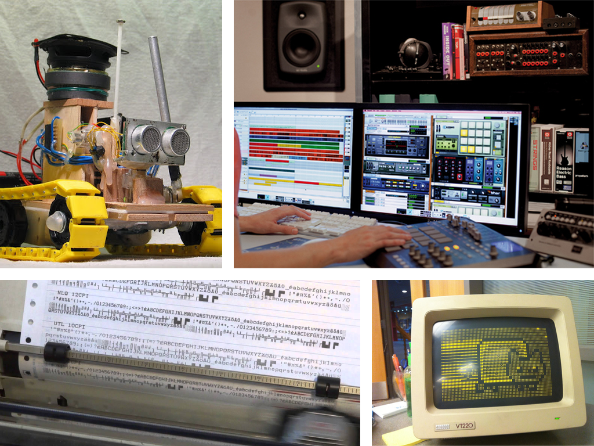
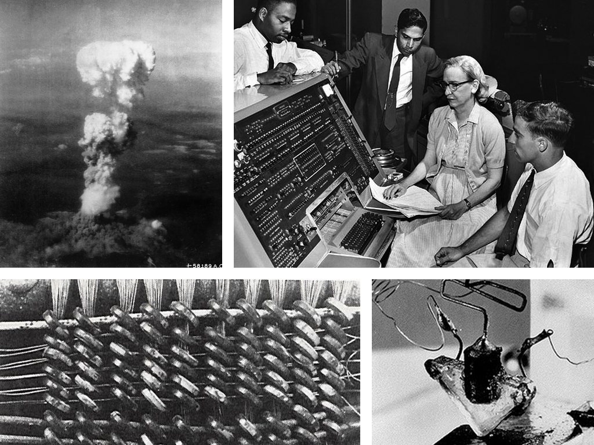
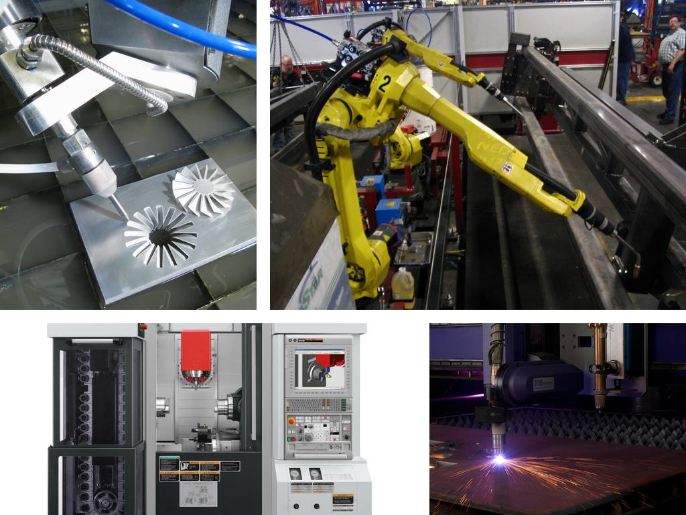
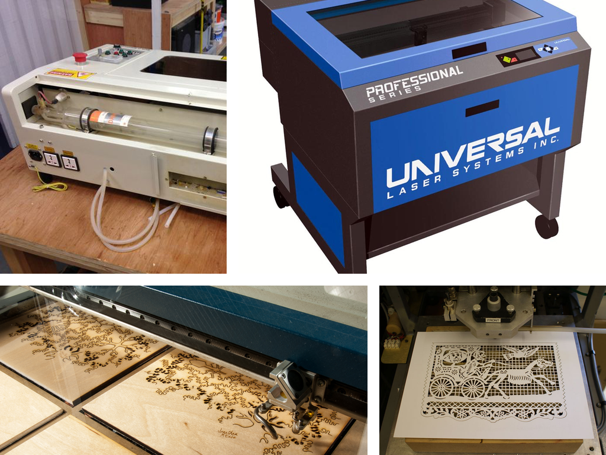

## Laser Cutters
## 3D Printers 
## and Python
&nbsp; <p />
May, 2016 - Giles Hall

# END #

# Giles Hall
## github.com/vishnubob
## <i>giles@polymerase.org</i>

Note:
My name is Giles Hall.  I've been using python since 1996, and at this point, I consider it my mother tongue.  I utilize python throughout my life.  

# END #


Note:
Currently, I work for a company in Boston called "Ginkgo Bioworks" -- We apply genetic engineering to build useful customized organisms.  I use python to preform data analysis to help our engineering efforts.  We are hiring!  

# END #


Note:
I have many hobbies, including photography, gardening, cycling, cooking, electronics and making art.  And for each one of my hobbies, I've written at least a handful of python scripts related to it.

# END #


Note:
Here is a quick example.  In my backyard, I have a Davis weather station.  This transmit weather data wirelessly to a Raspberry Pi in my house.  I have another Raspberry Pi in the basement that monitors these data, and controls a set of relays that switch on spinklers for the garden.  To me, python is not just a programming language.  It's a tool I use to creatively express myself. 

# END #


Note: 
But, as powerful as python is, programming by its very nature is not a physical medium.  [beat] Frederic P. Brooks wrote one of my favorite quotes about computer programming in his book The Mythical Man-Month 

# END #
<blockquote>
&ldquo;The programmer, like the poet, works only slightly removed from pure thought-stuff. She builds her castles in the air, from air, creating by exertion of the imagination.&rdquo;
</blockquote>
&#45; Frederic P. Brooks, <i>The Mythical Man-Month</i>

Note:
"The programmer, like the poet, works only slightly removed from pure thought-stuff. She builds her castles in the air, from air, creating by exertion of the imagination."  [beat] The world is filled with these amazing but nebulous castles, but we can only really appreciate them with the aid of a computer.  You can't share your code like you would a painting or a sculpture or a well cooked meal.

# END #
# How do we make code physical and tangible?

Note:
I realize not everything I said is true, we use software to manipulate our physical world every day.
# END #



Note:
Our computers produce sound, and light and churn out printed documents.  There are many ways you can write code as a generator for these processes.  This is what I want to talk about, how to use code to design physical objects with python.

# END #


Note:
Before there were computers, people had to make things by hand.  The period between the late 19th century and the middle of the 20th century was collectively known as the "Machine Age".  During this time, we perfected the art of building parts at an industrial scale using a process called "subtractive manufacturing".  This includes processes such as milling, turning, boring, broaching, sawing, reaming and tapping.  The general idea was to shape bulk stock into some kind of part by removing material with incredible precision.

# END #



Note:
After the 1950s, the world entered the atomic age and ushered in the digital computer.  During the 1940s and 50s, existing tools like mills and lathes were connected to electric motors that were controlled with punched tape.  This was the first step towards automation of machine tools, and as computers evolved in sophistication, it spawned a new field of fabrication called Computer Numerical Control, known as CNC.

# END #



Note:
Today, computer controlled automation is ubiquitous throughout all areas of manufacturing.  Not only has the computer hardware and software programming evolved in sophistication, but there are new manfacturing tools and processes that have only existed in the last few decades.  This includes plasma cutters, water jets, 5-axis milling machines, lithography... and two of my favorite technologies.

# END #

<image height="400px" src="images/zing.jpg" /> <image height="400px" src="images/thingomatic.jpg" />

Note:
laser cutters and 3D printers.  From here, we will examine each of these technologies and discuss how we can use Python to create designs for these tools.  First, laser cutters!

# END #



Note:
Laser-cutters are devices that utilize high-powered lasers to etch or cut a variety of different materials. 
Most commercially available laser cutters are capable of cutting and etching paper, wood, plastic, leather, and fabric up to a certain thickness.  
The laser tube is static to the device, typically mounted towards the back. 
Carefully positioned mirrors bouce the laser light to the laser head.  
The head is composed of mirrors and lenses that focus the laser beam onto the target material.  
Stepper motors traverse the head in the X/Y plane parallel to the work material, tracing out the contours for a given design.  
Laser cutters are incredibly precise, and are capable of producing complex designs with intricate detail.

# END #


Note:
Digital designs for laser cutting typically start as vector graphics.  Design programs like Adobe Illustrator and Inkscape are vector illustration packages.  This is in contrast to programs like the GIMP and Photoshop, which are raster, or bitmap, oriented graphic packages.  Vector graphics make it easy for the software controlling the motion of the laser cutter to translate the graphics into motion.  

# END #

<svg xmlns="http://www.w3.org/2000/svg" version="1.1"
      width="700" height="250" viewBox="0 0 700 250">
  <rect x="350" y="23" width="200" height="200" fill="darkred"
      stroke="white" stroke-width="10" />
  <circle cx="300" cy="100" r="80" fill="cyan"
      stroke="darkgrey" stroke-width="5" />
</svg>

```xml
<svg xmlns="http://www.w3.org/2000/svg" version="1.1"
      width="120" height="120" viewBox="0 0 236 120">
  <rect x="14" y="23" width="200" height="7" fill="red"
      stroke="black" stroke-width="1" />
  <circle cx="24" cy="33" r="25" fill="green"
      stroke="blue" stroke-width="2" />
</svg>
```

Note:
This is a simple example of an SVG document.  SVG files are XML documents, and a closely related cousin to HTML.  HTML and SVG share a lot of the attribute names for various tags, like width, height, style, and border.  They share style syntax as well, and later revisions of SVG support cascading style sheets. 

# END #

<svg xmlns="http://www.w3.org/2000/svg" version="1.1"
      width="400" height="240" viewBox="0 0 400 240">
  <rect x="10" y="10" width="100" height="100" fill="red"
      stroke="white" stroke-width="10" />
  <rect x="60" y="60" width="100" height="100" fill="green"
      stroke="white" stroke-width="10" />
  <rect x="110" y="110" width="100" height="100" fill="blue"
      stroke="white" stroke-width="10" />
</svg>

```xml
<svg xmlns="http://www.w3.org/2000/svg" version="1.1"
      width="400" height="240" viewBox="0 0 400 240">
  <rect x="10" y="10" width="100" height="100" fill="red"
      stroke="white" stroke-width="10" />
  <rect x="60" y="60" width="100" height="100" fill="green"
      stroke="white" stroke-width="10" />
  <rect x="110" y="110" width="100" height="100" fill="blue"
      stroke="white" stroke-width="10" />
</svg>
```

Note:
One tricky gotcha about SVG is that the coordinate system starts at (0, 0) in the top left corner, and increases in value as you travel towards the right of the screen in the X-axis as well as down towards the bottom of the screen in the Y-axis.  For example, notice that the red square has the smallest XY insertion point at (10, 10) while the blue square has the largest insertion point of (110, 110).


# END #
<svg xmlns="http://www.w3.org/2000/svg" version="1.1"
      width="400" height="240" viewBox="0 0 400 240">
    <path d="M 20,20 L 40,40 L 40,80 L 80, 80 L 100, 120, L 20, 220 L 200, 200"
        fill="none" stroke="white" stroke-width="10" />
</svg>

```xml
<svg xmlns="http://www.w3.org/2000/svg" version="1.1"
      width="400" height="240" viewBox="0 0 400 240">
    <path d="M 20,20 L 40,40 L 40,80 L 80, 80 L 100, 120, L 20, 220 L 200, 200"
        fill="none" stroke="white" stroke-width="10" />
</svg>
```

Note:
Now for the best part of SVG, paths.  A path is simply a list of connected like segments that are used to build complex ploygons.  Segments can be straight or curved with control points.  Coordinates can be specified in absolute coordinates or relative coordinates.  The path itself is broken up into single letter commands like 'M' for "move" or "L" for line and then two or more numbers that represent coordinates.  You can do a lot with just circles and squares, but paths allow us to build incredibly complex shapes.  When we start thinking about the laser cutter, our path might dictacte the exact path the laser head will follow.

# END #


# END #


# END #


# END #


# END #


# END #
```python
import svgwrite

def wave(size, finger_count, finger_width, thickness):
    center = map(lambda pos: pos / 2.0, size)
    pen_x = center[0] - ((finger_count + 1) / 2.0 * finger_width)
    pen_y = center[1]
    y_map = [thickness, 0, -thickness, 0]
    x_map = [0, finger_width]
    for idx in range(finger_count * 2 + 2):
        pen_x += x_map[idx % 2]
        pen_y += y_map[idx % 4]
        yield (pen_x, pen_y)
```

# END #
```python
size = (800, 200)
wavepts = list(wave(size, finger_count=12, finger_width=50, thickness=20))
path = ("M %s,%s" % path[0]) + 
        str.join(' ', ["L %s,%s" % pt for pt in path[1:]])
dwg = svgwrite.Drawing("images/wave.svg", size=size)
dwg.add(dwg.path(d=path, fill="none", stroke="red", stroke_width=10))
dwg.save()
```

# END #


# END #
``` python
import math
import svgwrite

def sunflower(canvas, size, florets=200, floret_radius=5):
    center = map(lambda pos: pos / 2.0, size)
    constant = (min(center) - floret_radius * 2.0) / math.sqrt(florets)
    for idx in range(1, 1 + florets):
        radius = constant * math.sqrt(idx)
        angle = idx * math.radians(137.5)
        pt = (radius * math.cos(angle), radius * math.sin(angle))
        pt = map(sum, zip(center, pt))
        canvas.add(dwg.circle(pt, fill="lightgrey", r=floret_radius))

size = (700, 700)
dwg = svgwrite.Drawing("images/sunflower.svg", size=size)
sunflower(dwg, size, floret_radius=10)
dwg.save()
```
<a href="http://localhost:8888/notebooks/PyCon2016%20Notebook.ipynb" data-preview-link>demo</a>

# END #

What is 3D printing, and what is it good for?
Why is Python a great language to generate physical things?
3D Printers (15 min)
Fabrication pipeline (5 min)
Python, OpenSCAD, STL files
Generating G-Code via slicing
Printing with OctoPrint
The basics of OpenSCAD (5 min)
Primitive solids
Boolean operations
Using python to express OpenSCAD
Generating a flower-pot with python (5 min)
Examination of the flower pot geometry
Translating the physical plan into python code
Adding parameters to python code to customize the flower pot
Sophisticated examples (10 min)
Snowflake project (5 min)
Overview of the snowflake project
# END #

<video class="stretch">
    <source data-src="video/snowflakes.mp4" type="video/mp4"/>
</video>
# END #

Translating the snowflake data into SVGs for use with the laser cutter
# END #

Model Rockets (5 min)
# END #

Overview of the rockit project
# END #

Examples of different model rockets, with pictures and video
# END #

Details about the pipeline and customization
# END #

Resources (5 min)
# END #

How to gain access to these tools if you don't own them.
# END #

Link to webpage with slide deck, libraries, tutorials, and other example projects.
# END #
